# ADEGA Wordpress Multisite

## Folders

* `src/` Development folder (/wp-content).
* `config/` Configuration folder for NGINX and Wordpress. 
* `doc` Documentation related files.
* `.wp/` Web root folder (/). Excluded from Git repo.
* `.db/` Database files. Excluded from Git repo.
* `logs/` Web server logs. Excluded from Git repo.

## Environment
### Installation
* Prerequisites:
    * Git
    * Docker
* Clone repository to your develop folder:
```console
git clone https://github.com/Asociacion-Defensa-Ecoloxica-de-Galicia/wordpress-multisite.git
```
### Using environment
* Run containers.
```console 
$ docker compose up -d
```
* Access Wordpress at http://localhost:8080.
* Stop containers.
```console
$ docker compose down
```
## Setting up Wordpress

### Basic setup

Open Wordpress and follow dialogs.

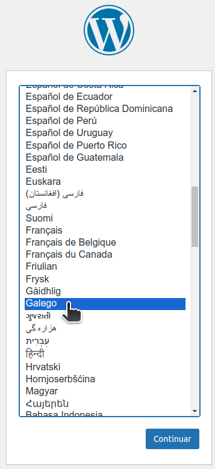
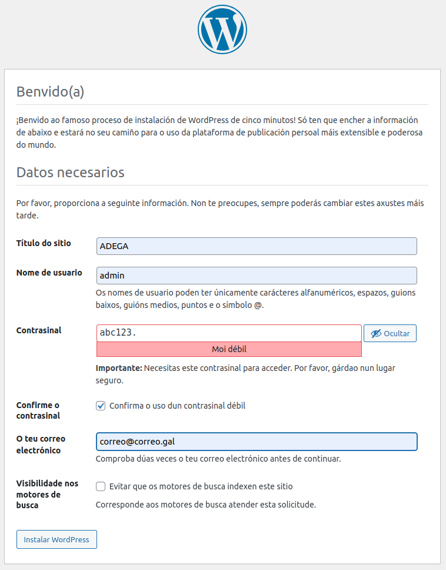
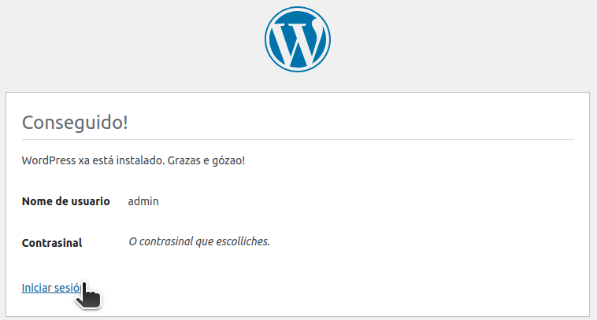
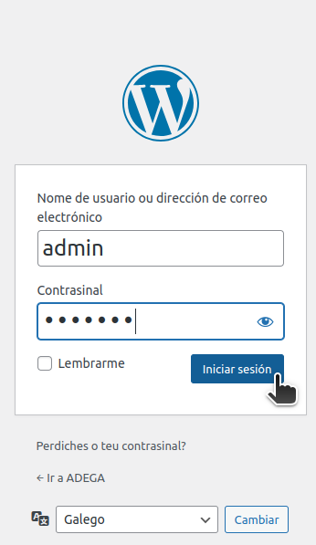

### Setting up WP multisite
1. Enable Multisite.

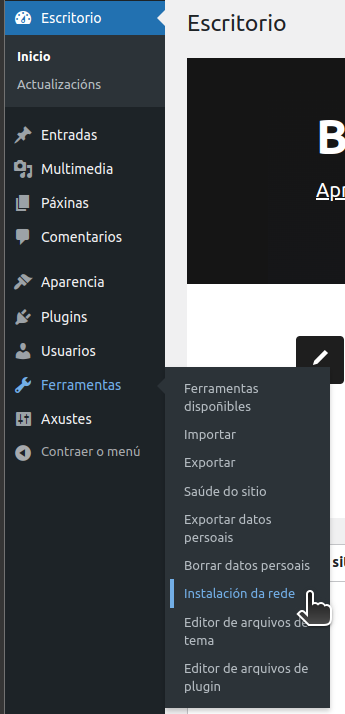
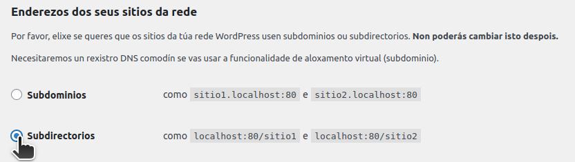

2. Uncomment `config/wp/wp-config.php` multisite lines and save.

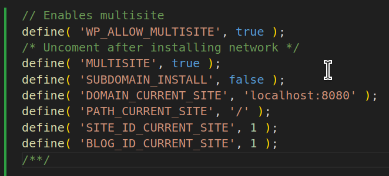

3. Login again.

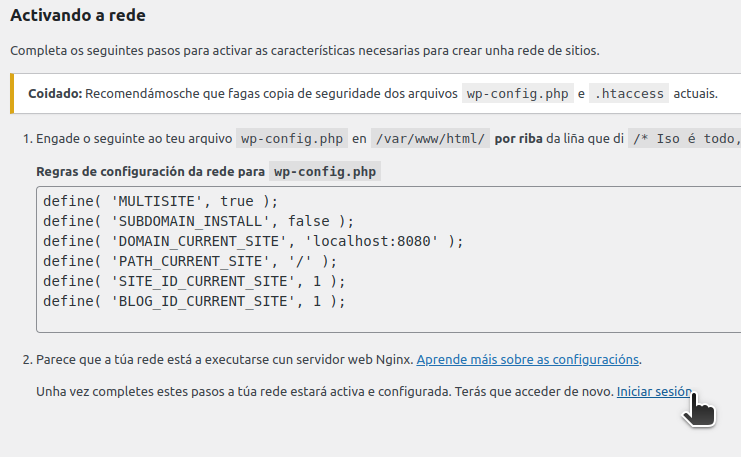

4. Go to `sites` WP pannel.

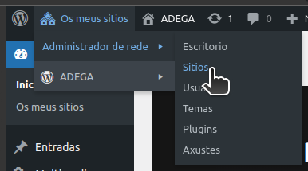

## Managing network sites

### Create new site.

1. Create the site.

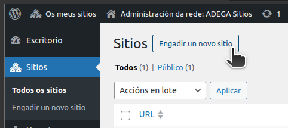
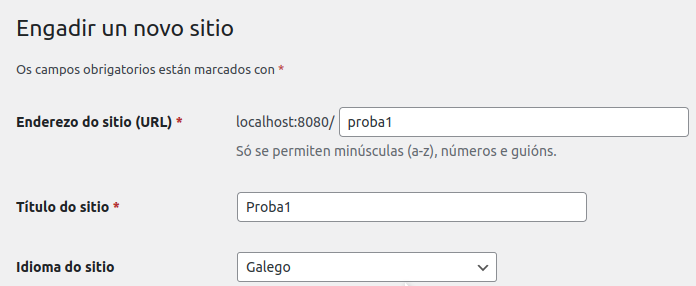

2. Go to new site pannel.

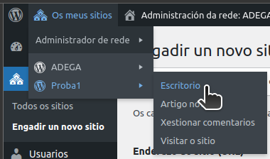

### Managing multisite themes and plugins

WP network sites can only use the themes and plugins previously authorized by the network admins. You can authorize themes and plugins installing them by `nerwork administrator` pannel.

1. Go to network plugins or themes pannel.

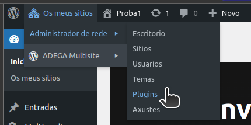

2. Search and install the desired plugin or theme.

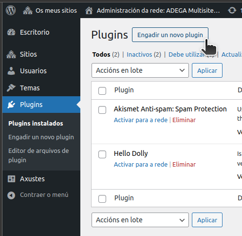

3. ONLY FOR THEMES: enable theme for network so it becomes available for all the network sites.

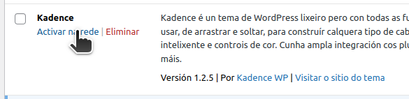

4. Now you can apply the installed theme or enable the installed plugin for any site opening correspondig site pannel.