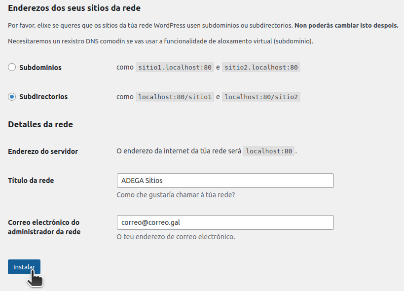

# ADEGA Wordpress Multisite

## Folders

* `src/` Development folder (/wp-content).
* `config/` Configuration folder for NGINX and Wordpress. 
* `.wp/` Web root folder (/). Excluded from Git repo.
* `.db/` Database files. Excluded from Git repo.
* `logs/` Web server logs. Excluded from Git repo.

## Instructions
### Installing environment
* Prerequisites:
    * Git
    * Docker
* Clone repository to your develop folder:
```console
git clone https://github.com/Asociacion-Defensa-Ecoloxica-de-Galicia/wordpress-multisite.git
```
### Using environment
Run containers
```console 
$ docker compose up -d
```
Stop containers
```console
$ docker compose down
```

### Using WP multisite
1. Enable Multisite.




2. Uncomment `config/wp/wp-config.php` multisite lines and save.


3. Login again.


4. Go to `sites` WP pannel.


5. Create new site.


6. Go to new site pannel.


### Managing multisite themes and plugins

WP network sites can only use the themes and plugins previously authorized by the network admins. You can authorize themes and plugins installing them by `nerwork administrator` pannel.


